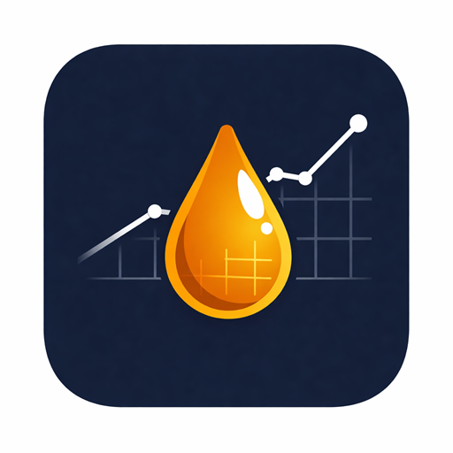

  

<h1 align="center">Backyard Sap Tracker</h1>

  Track maple sap collection, weather, boiling, and syrup production at home.

  <strong>$1.99</strong> &mdash; one-time purchase, no subscriptions, no ads

  <a href="https://play.google.com/store/apps/details?id=com.saptracker.app">Google Play</a>&nbsp;&nbsp;|&nbsp;&nbsp;<a href="https://apps.apple.com/us/app/backyard-sap-maple-syrup/id6759408463">App Store</a>

---

A tracking tool for hobby maple syrup makers who tap a handful of trees at home. Track everything from tap to bottle on your phone with no account required.

All data is stored locally on your device. No account, no cloud, no tracking.

## Resources

- **[Support Site](https://notmilk.github.io/BackyardSapTracker-support/)** -- FAQ, guides, and how-to articles
- **[Wiki](https://github.com/NotMilk/BackyardSapTracker-support/wiki)** -- Detailed documentation for every feature
- **[Report a Bug](https://github.com/NotMilk/BackyardSapTracker-support/issues/new?template=bug_report.yml)**
- **[Request a Feature](https://github.com/NotMilk/BackyardSapTracker-support/issues/new?template=feature_request.yml)**
- **[General Feedback](https://github.com/NotMilk/BackyardSapTracker-support/issues/new?template=feedback.yml)**
- **[Privacy Policy](https://notmilk.github.io/BackyardSapTracker-support/privacy)**

## Key Features

- **Dashboard** -- Sap flow days, gallons collected, estimated syrup output. Calendar and timeline views with weather and sap flow predictions.
- **Tree and Tap Management** -- Add trees by species, install taps per season, track per-tap volumes and Brix.
- **Sap Collection** -- Log by tap with optional Brix. Multiple collections per day. Rule of 86 syrup estimates.
- **Boil Tracking** -- Record sessions with sap volume and syrup output. Auto-links collections to boils.
- **Weather** -- Open-Meteo or NWS. Sap flow prediction from freeze/thaw cycles. 45-day extended forecast.
- **Data Export** -- JSON full backup or CSV by table. Auto-backup to device storage.

## Privacy

All data stays on your device. The app makes network requests only to fetch weather data. No analytics, no telemetry, no ads.

Read the full [Privacy Policy](https://notmilk.github.io/BackyardSapTracker-support/privacy).
